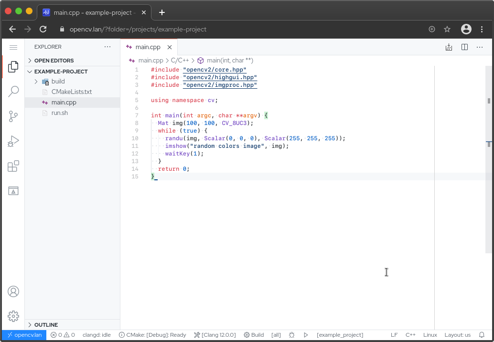
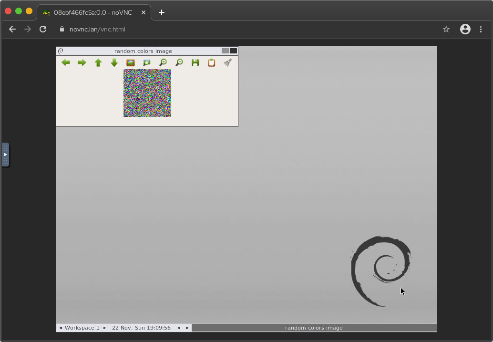
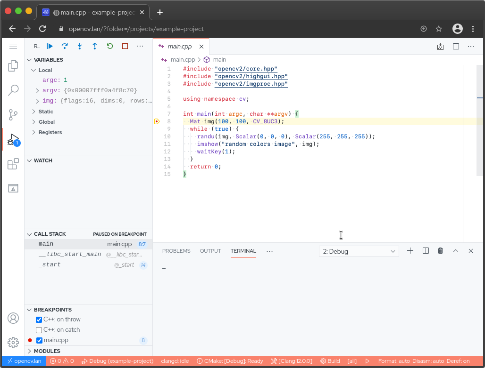

# OpenCV Code Server
Code Server Docker image for OpenCV with C++ development on the browser. Contains OpenCV, NLopt and R libraries. Also contains a novnc container for visualization needs. Supports syntax highlighting and intellisense for c++ and cmake files.

Jump right into coding, do not lose time with compiling OpenCV, configuring IDEs or other not so important things than your actual code.

## TODO
- [x] Debug example with launch.json
- [ ] CUDA support with nvidia-docker
- [ ] Python support
- [x] Test on Linux (Works on Fedora 33 with moby-engine, docker-compose, cgroupsv1)
- [ ] Test on macOS
- [ ] Test on Windows

## Prerequisites
- git
- docker
- docker-compose

## Clone
```bash
git clone https://github.com/works-on-my-machine/opencv-code-server.git
```

## Modify
By default, uses:
- Eclipse key bindings
- Github Light Theme

In order to change default settings modify following files:
```bash
./opencv-code-server/settings/extensions.csv # Add remove vscode extensions
./opencv-code-server/settings/settings.json # Add remove vscode settings
```

## Prepare
### DNS Records
Since we will be accessing code-server from browser, prepare following DNS records in your DNS server. Editing `/etc/hosts` file is ok too. (Usually `c:\windows\system32\drivers\etc\hosts` for Windows)

I used suffix `.lan` as an example. It can be anything as long as you can access it. Nginx proxy will redirect them to correct containers.
```
127.0.0.1 opencv.lan
127.0.0.1 novnc.lan
```
### Certificates
Create certificate-key pair. I recommend [mkcert](https://github.com/FiloSottile/mkcert). Certificates must be valid for DNS records above.

```bash
mkcert opencv.lan novnc.lan
```
## Install
```bash
CERTIFICATE_PATH=<my-certificate-path> \
CERTIFICATE_KEY_PATH=<my-certificate-key-path> \
NOVNC_DNS=novnc.lan \
NOVNC_WIDTH=800 \
NOVNC_HEIGHT=600 \
CODE_SERVER_DNS=opencv.lan \
CODE_SERVER_PUID=1000 \
CODE_SERVER_PGID=1000 \
CODE_SERVER_PASSWORD=password \
CODE_SERVER_SUDO_PASSWORD=password \
CODE_SERVER_CONFIG_VOLUME=<my-config-path> \
CODE_SERVER_PROJECTS_VOLUME=<my-projects-path> \
./install.sh
```
Using absolute paths is the recommended way. If you want to use relative paths, make sure they are relative to `docker-compose.yaml` file. Try to keep config and projects path outside of this repository for a persistent experience.

## Use
Open your favorite browser and access to `https://opencv.lan` and `https://novnc.lan`. Checkout example project. When you open your first project on the code-server it will ask you to select a kit, clang 12.0.0 is used for examples. It can be changed from status bar (See screenshots).




## Debug
You can debug your code with LLDB debugger. Please check example project's launch.json and tasks.json files for more info.



## Clean up
Removes configuration files and containers. Does not touch other files.
```bash
./clean.sh
```

## Advanced
### Modifying Libraries
Modify `Dockerfile` in order to add or remove libraries to container where code-server is running. Following are installed:
- OpenCV
- NLopt
- R
- clangd

OpenCV build is optimized for AVX2 (I am using Intel i7 4790K). Change this line in `Dockerfile` according to your CPU. For more info [see](https://github.com/opencv/opencv/wiki/CPU-optimizations-build-options).

### Editing Nginx Configuration
Nginx acts as a reverse proxy server in front of `opencv-code-server` and `novnc`. Configuration files can be found under `./opencv-nginx-proxy/conf.d` folder.
